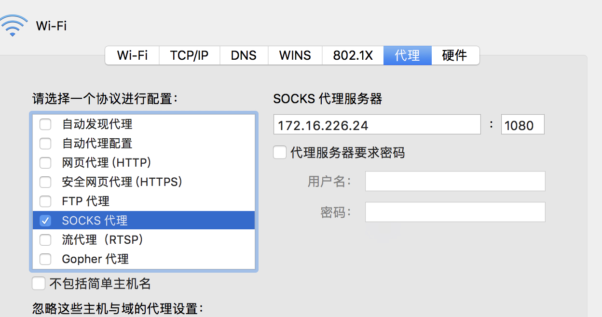

# 1.菜单栏1
testtesttesttesttesttesttesttesttesttesttesttesttesttesttesttest
## 1.1 菜单栏1.1
testtesttesttesttesttesttesttesttesttesttesttesttesttesttesttest
## 1.2 菜单栏1.2
testtesttesttesttesttesttesttesttesttesttesttesttesttesttesttesttesttesttesttesttesttesttesttest
### 1.2.1 菜单栏1.2.1
testtesttesttesttesttesttesttesttesttesttesttesttesttesttesttest
### 1.2.2 菜单栏1.2.2
testtesttesttesttesttesttesttest

# 1.3 菜单栏1.3
testtesttesttesttesttesttesttesttesttesttesttesttesttesttesttest
testtesttesttesttesttesttesttesttesttesttesttesttesttesttesttesttesttesttesttesttesttesttesttest
testtesttesttesttesttesttesttesttesttesttesttesttesttesttesttest

# 2.菜单栏2
testtesttesttesttesttesttesttesttesttesttesttesttesttesttesttest
testtesttesttesttesttesttesttesttesttesttesttesttesttesttesttest
testtesttesttesttesttesttesttesttesttesttesttesttesttesttesttest
testtesttesttesttesttesttesttest
# 2.1 菜单栏2.1
testtesttesttesttesttesttesttest
testtesttesttesttesttesttesttest

# 2.2 菜单栏2.2
testtesttesttesttesttesttesttesttesttesttesttesttesttesttesttest
testtesttesttesttesttesttesttest
testtesttesttesttesttesttesttest
# 2.3 菜单栏2.3
testtesttesttesttesttesttesttest